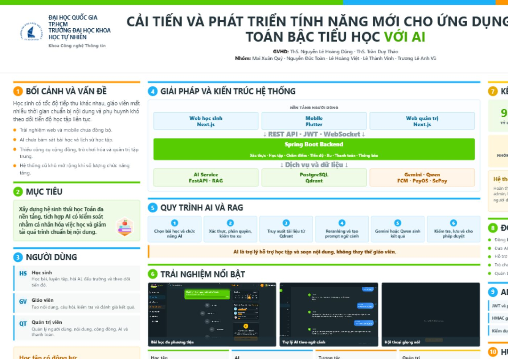

# AIMath - Poster TTDATN

Poster A0 ngang cho đề tài:

> Cải tiến và phát triển tính năng mới cho ứng dụng học Toán bậc tiểu học với AI



## Tệp chính

- `poster/aimath-poster-a0.html`: bản nguồn có thể chỉnh sửa và in từ trình duyệt.
- `poster/aimath-poster-a0.png`: ảnh poster kích thước 2800 x 1980 px.
- `poster/aimath-poster-a0-preview.png`: ảnh xem trước nhẹ hơn.
- `assets/`: logo, ảnh giao diện và SVG AIMath được poster sử dụng.

## Xem tại local

Chạy một HTTP server tại thư mục gốc của repository:

```powershell
python -m http.server 8099 --bind 127.0.0.1
```

Sau đó mở:

```text
http://127.0.0.1:8099/poster/aimath-poster-a0.html
```

Khi in, chọn khổ A0 ngang, lề bằng 0 và bật in đồ họa nền.
